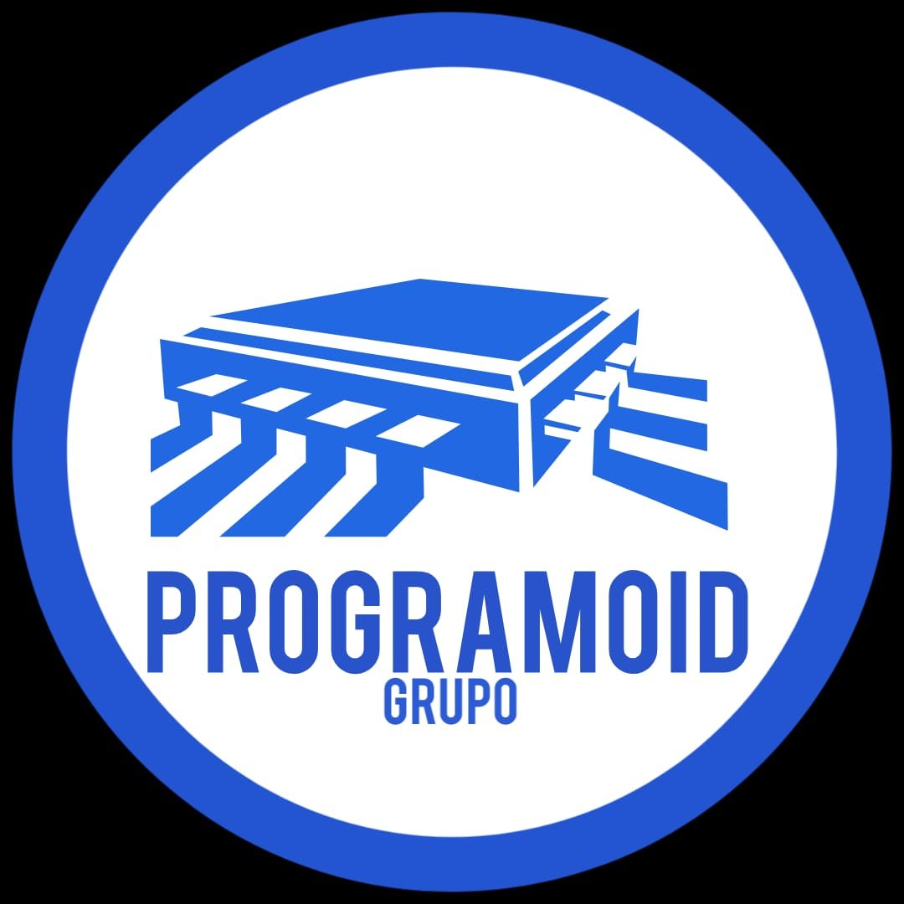

 

      
      <h3 align="center"> Software de Análise do Eleitorado</h3>

  <a href ="#Nosso_Objetivo"> Nosso Objetivo </a>  • 
  <a href ="#O_que_é_o_Programoid"> O que é o Programoid? </a>  • 
  <a href ="#hourglass_flowing_sand-planejamento-de-entregas"> Planejamento </a>  • 
  <a href ="#Sprints"> Sprints </a>  • 
  <a href ="#card_index_dividers-cards-das-sprints"> Cards </a>  •
  <a href ="#computer-tecnologias-utilizadas"> Tecnologias </a>  • 
  <a href ="#bulb-metodologia-utilizada"> Metodologia </a>  • 
  <a href ="#bar_chart-backlog-do-produto"> Backlog </a>  •
  <a href ="#mortar_board-equipe"> Equipe </a> 

 

## :rocket: O Projeto
Trabalho desenvolvido pelos integrantes do grupo 4 do curso de Desenvolvimento de Software Multiplataforma na Faculdade de Tecnologia de São José dos Campos, SP, Brasil, com a finalidade de criação de um software de busca de dados rápida e eficaz do eleitorado das eleições brasileiras.

 

## :dart: Proposta

**Desenvolver um Site onde possa ser vistos dados eleitorais de eleições passadas:**  

 > **Conteúdos**

 - [x] Visualização de Dados Eleitorais
 - [x] Documentação Sobre o Projeto
 - [x] Suporte aos Usuários
 - [x] Apresentação do Site

 > **Requisitos**

 - [x]  Fácil Edição de Código;
 - [x]  Usar python no Back-End

  
**:link: Clique no link abaixo para visualizar o modelo do site no Figma.**  
> [Protótipo do Site](https://www.figma.com/proto/IxIHeo1bBkB5B3z1DoVQIN/PI-Fatec?node-id=1%3A7&scaling=scale-down-width&hide-ui=1)

 

**:link: Clique no link abaixo para visualizar os custos do Projeto.** 
> [Fatura](https://github.com/Grupo-1-2020-PI-FATEC-ADS/SOS-EDUCA/blob/master/SPRINT_0/Fatura%20SOS%20EDUCA.pdf)

 

**:link: Clique no link abaixo para visualizar o site hospedado:**
>  [http://soseduca.site](http://soseduca.site/)
 
  _Nota 1: O presente projeto tem apenas fins didáticos, portanto não cumprirá a [Lei n° 13.853, de 08/07/2019](http://www.planalto.gov.br/ccivil_03/_ato2019-2022/2019/lei/l13853.htm) da Lei Geral de Proteção de Dados Pessoais (LGPD) em sua totalidade._
  
  _Nota 2: Devido ao tamanho disponível para hospedagem, nem todas as funcionalidades do site puderam ser hospedadas, todavia as principais funcionalidades, tais como compra e área do administrador, estão disponíveis para verificação. O Código do site em LocalHost, no entanto, compreende todas as funcionalidades._

 

## :camera_flash: Apresentação Final do Projeto

**Clique no link abaixo para visualizar o vídeo final do projeto:**  
> :movie_camera: [Vídeo Final](https://www.youtube.com/watch?v=gqUqGaXipe8&t=20s&ab_channel=fatecsjc)

 

## :hourglass_flowing_sand: Planejamento de Entregas

- [x] [SPRINT 0](https://github.com/Grupo-1-2020-PI-FATEC-ADS/SOS-EDUCA/tree/master/SPRINT_0) - 07/09/2020 a 27/09/2020

- [x] [SPRINT 1](https://github.com/Grupo-1-2020-PI-FATEC-ADS/SOS-EDUCA/tree/master/SPRINT_1) - 28/09/2020 a 17/10/2020

- [x] [SPRINT 2](https://github.com/Grupo-1-2020-PI-FATEC-ADS/SOS-EDUCA/tree/master/SPRINT_2) - 19/10/2020 a 08/11/2020

- [x] [SPRINT 3](https://github.com/Grupo-1-2020-PI-FATEC-ADS/SOS-EDUCA/tree/master/SPRINT_3) - 09/11/2020 a 29/11/2020

- [x] Apresentação Final - 30/11/2020 a 06/12/2020

- [x] Feira de Soluções - 07/12/2020 a 13/12/2020

<h1 align="center"> </h1>

 

## :calendar: As Sprints

☑️ SPRINT 0 ([Link da Pasta](https://github.com/Grupo-1-2020-PI-FATEC-ADS/SOS-EDUCA/tree/master/SPRINT_0)): Concluído :heavy_check_mark:

☑️ SPRINT 1 ([Link da Pasta](https://github.com/Grupo-1-2020-PI-FATEC-ADS/SOS-EDUCA/tree/master/SPRINT_1)): Concluído :heavy_check_mark:

☑️ SPRINT 2 ([Link da Pasta](https://github.com/Grupo-1-2020-PI-FATEC-ADS/SOS-EDUCA/tree/master/SPRINT_2)): Concluído :heavy_check_mark:

☑️ SPRINT 3 ([Link da Pasta](https://github.com/Grupo-1-2020-PI-FATEC-ADS/SOS-EDUCA/tree/master/SPRINT_3)): Concluído :heavy_check_mark:

 

## :card_index_dividers: Cards das Sprints

 

## :computer: Tecnologias Utilizadas

<h1 align="center"> </h1>

* **Banco de Dados:** MySQL
* **Back-end:** JavaScript e PhP
* **Front-end:** HTML, CSS e Bootstrap
* **Ferramentas:** Visual Studio Code e Figma

 

## :bulb: Metodologia Utilizada

* **Metodologia Ágil:** Framework [Scrum](https://www.desenvolvimentoagil.com.br/scrum/)

 

## :bar_chart: Backlog do Produto

<h1 align="center"> </h1>

 

## :mortar_board: Equipe 

|Nome|Função|Linkedin|GitHub|Avatar|
| -------- |-------- |-------- |-------- |-------- |
|**Beatriz Nonato**|Scrum Master|[@LinkedIn](https://www.linkedin.com/in/beatriz-nonato-aa11017a/)|[@GitHub](https://github.com/BeaNonato)||
|**Nayara Lopes**|Desenvolvedor 1| [@LinkedIn](https://www.linkedin.com/in/nayara-suelen-382420137/)|[@GitHub](https://github.com/NayDev)||
|**Raphael Lisboa**|Desenvolvedor 2| [@LinkedIn](https://www.linkedin.com/in/raphael-lisboa-7b3597187/)|[@GitHub](https://github.com/raphaelprado)||
|**Bryan Ribeiro**|Desenvolvedor 3|[@LinkedIn](https://www.linkedin.com/in/bryanrribeiro/)|[@GitHub](https://github.com/BryanRibeiro)||
|**Jeferson Henrique**|Desenvolvedor 4|[@LinkedIn](https://www.linkedin.com/in/jeferson-silva-249884149/)|[@GitHub](https://github.com/JefersonHenrique)||
|**Jefferson Reis**|Desenvolvedor 5|[@LinkedIn](https://www.linkedin.com/in/jefferson-silva-94b94218)|[@GitHub](https://github.com/jeffersonrrs)||
   

 

 <h1 align="center"> </h1>
 
 <h5 align="center">  Projeto Integrador - Fatec São José dos Campos </h5>
